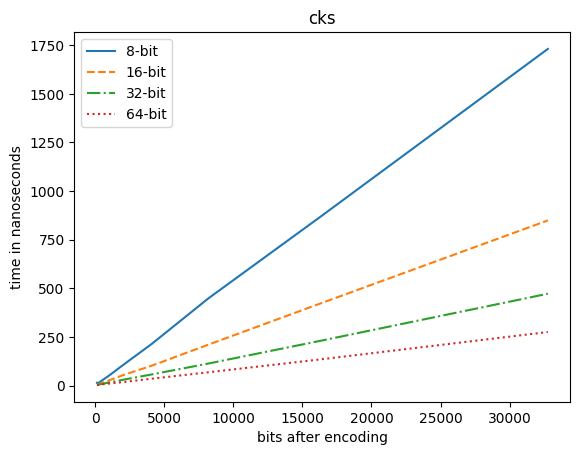
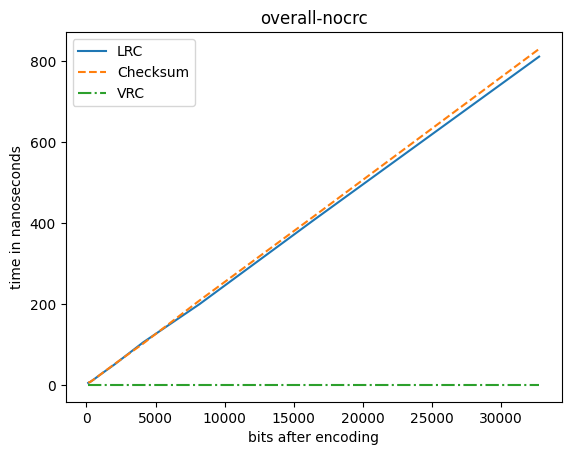

# Assignment 1
**Objective:** Design and implement an error detection module.

**Name:** Rwitick Ghosh

**Class:** BCSE - III

**Group:** A1

**Date:** 03-08-2021

---

## Purpose
The purpose of the of the project is to analyze the error correction capability of each of the four error control methods, namely: LRC, VRC, CRC and Checksum.

## Code Organization and Implementation
### Client
The `static/js` folder contains the files needed for client side accepting input and transmitting it to the server. The modules present in the folder are:

 - **cks.js**: To compute the checksum of the input. Default is 16-bit
 - **crc.js**: To compute the CRC of the input. Default polynomial is `1101`
 - **index.js**: To process the input file, check for validity, call the error control methods & send the data to the channel
 - **lrc.js**: To compute the LRC of the data. Default is 8-bit
 - **util.js**: To perform utilitarian actions which might become repetitive
 - **vrc.js**: To compute the VRC of the data. Default is Even parity

The folders `static/css` , `static/img` and `templates` contain code so that it provides a GUI interface for user interaction.

### Channel
The channel is implemented as a hook in the python Flask app. **The incoming request first goes through the channel and is then passed on to the server.** The file `application\channel` contains the functions needed for the channel implementation. The channel contains the following functions:

 - **bit_flip(data: str)**: Flips all the the bits in the data string. *This is a helper function only.*
 - **bit_error(data: str)**: Flips a random bit the data string
 - **burst_error(data: str)**: Flips a random sequence of bits in the data string
 - **random_error(data: str)**:  It randomly introduces bit error & burst error random number of times
 - **errorify(data: dict, fields: List[str], err_func: Callable[[str], str])**: It calls the err_func(coded_data) for each field in `fields`. The fields are the dictionary keys for the `data` dictionary.
 - **channel(data: dict)**: It chooses a error criteria and calls the `errorify(...)` function if required. The criterion available are:
	 - No error
	 - Bit error
	 - Burst error
	 - Random error

### Server
The file `app.py` handles the incoming requests. It contains all the handlers and other utility objects to be able to process the request. The folder `application` contains the following the files:
- **cks.​py**: To validate the checksum and return true or false
- **crc.​py**: To validate the CRC and return true or false
- **lrc.​py**: To validate the LRC and return true or false
- **vrc.​py**: To validate the VRC and return true or false

The server has no idea whether the data is corrupted or not or if any error has occurred. It simply performs the check and returns the response.

*The `app.py` file is also responsible for handling the benchmark process and for logging the details.*

## Input
A `txt` file conatining a stream of `1` and `0` is uploaded by the client. The data is then encoded into **each of the four** error control schemes and sent to the server.

## Output
A response is returned from the server in `json` format (*from python dict*) which tells if each individual technique detects an error and also mentions if there was an actual error. This helps to benchmark whether or not an actual error is caught by a specific error control method.

## Sequence Diagram

<!-- 
sequenceDiagram
    participant Client
    participant Channel
    participant Server
    Note left of Client: Uploads a file   of binary string
    Client->>+Channel: data having LRC, VRC,   CRC & Checksum encoded data
    Channel->>+Server: data   (may or may not be corrupted)
    Note right of Server: Checks the received   data and reports   the time taken &   detection success 
    Server->>+Client: sends back the report with additional info
 -->

<!-- 

 -->

## Test Cases & Analysis

### Vertical Redundancy Check
It is one of the most simple techniques, requiring least compute time. But it can only detect odd number of bit flips and hence its success is only `50%` in case of burst errors which makes it a poor choice.
The VRC fails for the case when any two bits are flipped.

Initial:

>1**1**100**0**01

After error:

>1**0**100**1**01

This error is **NOT DETECTED** by VRC.

### Longitudnal Redundancy Check

It is one of the most resilient error control technique. But it fails for a combination of bit error and burst error which may occur in the channel.

Initial:

>11101**1**011001**01**0001111111

After error:

>11101**0**011001**10**0001111111

This error is **NOT DETECTED** by LRC.

### Cyclic Redundancy Check

This technique makes use of linear algebra and some advanced mathematical concepts. Hence it requires more time to compute than other techniques. But it is also one of the best if implemented on hardware level rather than on software.
The CRC fails for the case of burst errors which produce the same CRC value:

Initial:

>1110110001010010100010101010010000010001011111111
>1100111110010010010100101001001000111111111110000
>010100100**11100000000100**000000011111111111111011

After error:

>1110110001010010100010101010010000010001011111111
>1100111100100100101001010010010001111111111100000
>10100100**00011111111011**000000011111111111111011

This error is **NOT DETECTED** by CRC.

### Checksum

This is a simple yet very effective way of detecting errors, it is also the most widely used especially in IPv4 and some other layer 2/3 devices' protocols because it is easy to implement.
The Checksum fails for the case of burst errors which produce the same Checksum value:

Initial:

>**11**101100010100101000101010100100000100010111111111100111110
>01001001010010100100100011111111111000001010010011100000000
>100000000011111111111111000010111111011110

After error:
>**00**101100010100101000101010100100000100010111111111100111110
>01001001010010100100100011111111111000001010010011100000000
>100000000011111111111111000010111111011110

This error is **NOT DETECTED** by Checksum.

## Results

### Time Comparison between various versions of Encoding techniques

- Vertical Redundancy Check

<!-- 

 -->

- Longitudnal Redundancy Check

<!-- 

 -->

- Circular Redundancy Check

- Checksum

### Time Comparison between each of Encoding techniques

### Time Comparison between each of Encoding techniques without CRC

### Error detection probabilities (typical case):

- VRC

- LRC

- CRC

- Checksum

### Side-by-side comparison of detection abilities for random error:

## Observations

- Every technique works well for "bit error". So we need to compare for "burst errors" or "random errors"
- VRC is the fastest to compute but the worst performing in real life
- CRC is the best but takes very long to compute irrespective of the polynomial size used (within approx. time limits)
- 64-bit checksum is faster than 8-bit checksum and the trend is very apparent in LRC too. This is due to lesser number of repititive task per constant amount of data word. But, it leads to larger codeword, i.e., redundant bits increases.
- The techniques used above can only detect the error(s) but cannot correct it.
- LRC if combined with TRC (Transverse Redundancy Check) can be used to pinpoint the exact error location.

---

## Project BY

**Name:** Rwitick Ghosh

**Class:** BCSE - III

**Group:** A1
